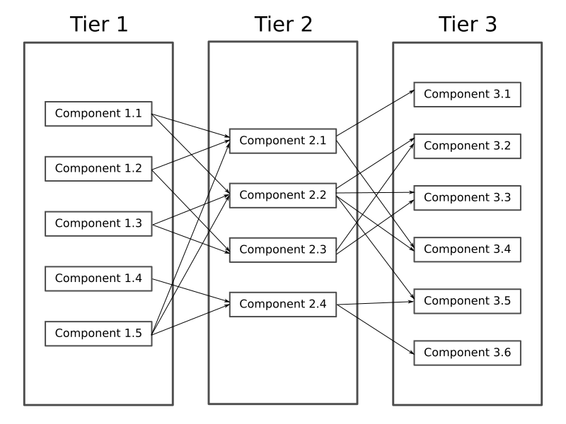

[Main page](../README.md)  

## Chapter 1: Table of contents:  
[No circular dependencies](#ncd)  
[Tiers and components](#tac)  
[Captain and a deckhand](#caad)  
[Keep data separated from processing](#kdsfp)  
[No static objects/references](#nsor)  

# Key concepts

## <a name="ncd"></a>No circular dependencies

Circular dependencies is a pain. Beware of them at any price.

Let you have an object A. A calls an object B to do something. B calls an object C. C calls an object D.

Circular dependency happens when an object D calls an object A to do something. As a react, object A may ask B to do something more, than B calls C, than C calls D again, than D calls A, A calls B, B calls C, C calls A (unexpectedly?)... and so on. This behavior is very difficult to read, understand and debug.

The word "object" here typically refers to an object as it is meant by object-oriented programming, and may be interpreted as an Java-object, for example. So "A calls B" here means something like this

```java
import com.somepackage.B;

public class A {

  B b;

  void doSomething(){
    b.doSomethingToo();
  }
}
```

We can also say that A depends on B in that case (do you see the import required to compile A.java?)

But this concept is not limited to OOP-object. If ```methodA()``` calls ```methodB()``` you may say that ```methodA()``` depends on ```methodB()```. Having a circular dependency for methods typically means a recursion. Recursion is a great thing sometimes, but if one recurrence consists of multiple method calls (especially if methods are placed in different blocks of code far from each other) it is very difficult to detect and debug.

You can also treat "object A" as any module of you application, such a gradle module, running instance, particular server, or something.


## <a name="tac"></a>Tiers and components

So, to make sure no circular dependencies will be presented, whole application is splitted into several **tiers** (some sources also call it "layers"). Concept is similar to multitier architecture, but particular tier roles are some different from [classic structure](https://en.wikipedia.org/wiki/Multitier_architecture).



Typical Android application has 4-5 tiers, but you may have more, if you need. Every tier contains one or more **components**.

Every component is represented with some Java object/class. Only one instance of every component class is typically presented in the app, although it is not mandatory for really complicated apps. Typically every component is placed into separate Java-package.

Sometimes it is possible for a component to consist of two or more Java classes/objects. In this case the component *must* be placed in separate package, and only one "main" class/object in this package has public visibility. Other classes inside a component are threated as "helper" classes and should be package-private (or at least you should think about them as a package private). Local entity classes/object contained in the component are also allowed to be public (see Entities section below). If you don't understand this paragraph, just ignore it for a while and use a "one component = one class/object inside a separate package" as a rule.

Here and below word *component* is treated as a reference to either a package either a "main public class" of this package. Public methods of this "main public class" are called *public component methods* or *component methods*.

There are general rules about how components are placed into tiers:
- Different components inside of one tier are independent of each other. They don't even know about each other's existence. So, ```Component 1.1``` has no idea about ```Component 1.2```, and vice versa
- Any component of a tier may depend on any components of next tier. ```Component 1.X``` may depend on any ```Component 2.X```. Any ```Component 1.X``` may call any methods of ```Component 2.X```
- Any tier has no idea about previous tier. Tier 3 components doesn't depend on any of Tier 2 or Tier 1 components and have no idea about their existence.
- Typically, Tier 1 components should have no direct access to Tier 3 components. So, any tier should access only next tier, but not the next after next. The only exception is allowed for Logic tier, see Logic section.


## <a name="caad"></a>Captain and a deckhand
Although tiers below should not depend on tiers above, sometimes it is required for underlying tiers to communicate with tiers above. Here "Captain and a deckhand" concept comes to.

Have you ever been on a ship? On a small sailing yacht, hundred-meters long oil tanker or a warship with a thousands of soldiers? Any ship, either small or big one, has a captain and a deckhands.

There two general forms of communication between people on board: the _command_ and the _report_.

The _command_ is a set of words which require immediate and explicit action: "Steer 15 degrees to the left!", "Fore-sail up!", "Move anchor down for 7 meters!". The captain is the one who sends _commands_ to a deckhands.

The _report_ is a set of words which contain important information, but are not expected to be followed with an action: "Anchor is ready to go!", "Fuel is running low!", "Fore-sail is torn, need to repair". Deckhands are informing the captain with the _reports_. Report may be a result of previous command, or may be standalone, caused by some unexpected events.

The main difference between report and command is that report is not followed by any action, even if it is urgent and dangerous to life. "Captain, there are stones 100 meters ahead, we're going right to them!" - this is an important information, but nobody on the ship will do something with that until the captain's _command_.

It is very important to understand in any particular moment: is the word spoken a command or report? On a big commercial ships commands and reports are highly formalized to make communications clear. On a small sailing yacht, in a company of friends, especially if their sailing experience is quite equal, difference between captain and a deckhand may become not so clear, but it still persist. "Hey, John, do you see this stones ahead? Let's change our heading to the left a little" - this words will follow by a crew's action, or no, depending on who says it.

Sometimes it is possible also to have some officers between captain and a deckhand guys (multitier ship). In this case command may come not only from the captain, but from the officers. But the general command-report concept remains the same: captain sends command to an officer: "Prepare to departure!", than officer brings commands to a deckhands or to a lower-level officers: "Warm up the engines!", "Check up people on board", "Make anchor ready to hoist". Reports may go back: from the deckhand to officer: "There is a problem in a reserve engine", and from the officer to a captain: "We are ready to departure in 10 minutes".

Typically it is not possible to move a ship (excepting very small boats) with only one man, you need a team usually. But any ship, including the smallest and biggest one, must have only one captain. It is impossible for a deckhand to send a _command_ to a captain - sailors beware of circular dependencies since the ancient times!

Same story happens with the components in your application. Typically an application consists of many components, it is impossible to build a complex application with one class only. Application components communicate to each other (typically with method calls). Every time one component communicates to another one you should understand: which component is a captain, and which one is a deckhand? Every time you see a method call, you should understand: is it a _command_ or _report_?

Typically, in this example

```java
import com.somepackage.B;

class A {

  B b;

  void doSomething() {
    b.doSomethingToo();
  }
}
```

A is the captain, and it sends _commands_ to B. B can use a Listener pattern (or Callback, or Observer, or something you prefer) to _report_ something useful to A.


```java
//no import here required!

class B {

  private List<BListener> listeners = new ArrayList<>();

  public void addListener(BListener listener) {
     listeners.add(listener);
  }

  public void removeListener(BListener listener) {
    listeners.remove(listener);
  }

  private void fireSomethingHappened() {
    for(BListener listener : listeners) {
      listener.onSomethingHappened();
    }
  }

  private void doingSomeRegularWork() {
    //....
    fireSomethingHappened();
    //....
  }


  public interface BListener {
    void onSomethingHappened();
  }
}
```


```java
import com.somepackage.B;

class A {

  B b;

  void subscribeOnBEvents() {
    b.addListener(new B.BListener() {
      public void onSomethingHappened() {
        onSomethingHappenedWithB();
      }
    });
    // Don't forget to unsubscribe when listening is no longer required
  }

  void onSomethingHappenedWithB(){
    //Analyze the situation here and provide new commands, if needed
  }
}

```

## <a name="kdsfp"></a>Keep data separated from processing

The code below is a common pattern for various frameworks, especially ORMs.

`user.save()`  

First time I've seen this pattern in 2011 in Microsoft's Entity framework. Years ago I stll find this pattern ambigious and bad.

The user above is expected to be an Entity containing a data, like username, gender, date of birth, etc. This data is independent by it's nature - username is expected to stay the same no matter of where this user is processed.

But, what code above does? It saves the user. But you can't just save the user by itself! (saving user's life or soul is not a something what can be done with code, so this is not the case). You save user to *somewhere*: to particular database, file, server storage, arraylist or whatever, but there is always a concrete place where you'll store the user.

What if we have multiple cases when this user should be saved to somewhere? The code above assumes that user entity knows something about where it shoud be stored. This can be ok in some particular cases, but in common this knowledge contradicts to the idea of independent entity.

To keep things clear I do not recomnend using this pattern. Instead, use separated   classes to represent the *data*

```java
class User {
    String username;
    Gender gender;
    Date dateOfBirth;
}
```

and use separated classes to *process* the data

`cacheFile.save(user)`  
`databaseStorage.store(user)`  
`serverApi.update(user)`  

See also Entities section about common entities restrictions.

## <a name="nsor"></a>No static objects/references

Never use static references to keep any data/fields/objects. Also never use singleton pattern. If you have a single non-static object, it is always easy to make it visible in a static context, but vice versa is troublesome.

What's wrong with static objects? Their creation time is always undefined. When you use non-static objects, you'll always have a constructor call, which explicitly defines the time, place and order of objects creation. For static objects creation is usually implicit and may come in unexpected moment in time, what leads to hard-to-predict behavior and bugs. This is especially true when your objects keep references on each other.

On Android, Application object is a good place to keep any singleton object's - it is guaranteed by Android that you will always have one an only one instance of Application class. It is allowed to have a static reference to an Application object (this is the only one exception from the rule above) with some restrictions, see below. I think you can easily find an analog of this class in other platforms.

Static methods are allowed, although, if \
a) Their execution and result depends only on it's parameters and nothing more. \
b) They do not change anything outside except it's parameters and return value \
Various helpers (classes, containing only static methods) are widely used to reduce boilerplate code

[Next chapter](../Chapter2/index.md)  
