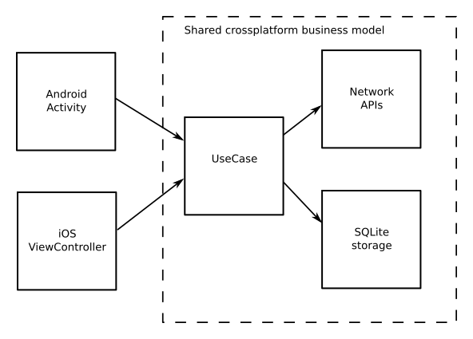
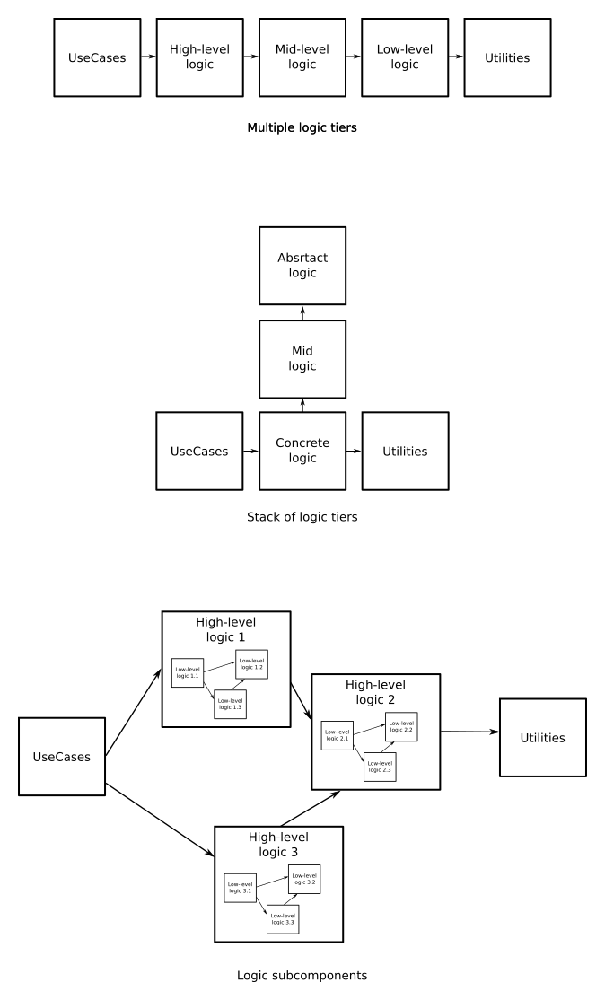
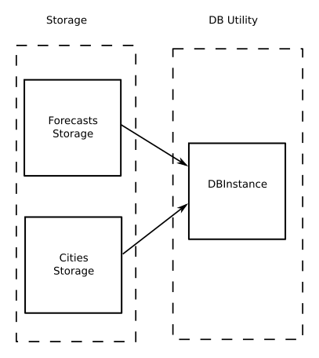

[Main page](../README.md)  
[Previous chapter](../Chapter1/index.md)  

# General Architecture description


[Full size image](./arch.png)

Okay, now we'll start with application architecture itself.

## Gradle role

Pay some attention to gradle modules on the image above. Although you can put all the code into one module, and replace gradle modules with separate Java packages, I'd recommend you to use modules as specified (or, if you know better solution for the purpose described below, please send me a note).

Gradle modules are used here as a tool to strictify dependencies. Pay attention to the `build.gradle` files (dependencies section) in the sample app. Gradle has following advantages over imports about dependencies control:

- **Explicit add of new dependencies.** While using packages, it is very easy to add ```import``` to another package. In most cases IDE like Android Studio will add ```import```'s almost automatically, sometimes even without notifying the developer. In contrast, Gradle dependencies are very explicit, they are almost never added automatically. Even when dependency is suggested by IDE, you'll have an explicit dialog and long-running gradle sync process after, so you'll less likely miss it.
- **Less dependencies, more control.** Every particular Java class file usually has dozens of imports, they are changing often, and it is not easy to control their consistence. In contrast, there are only few gradle dependencies in the project, and they are rarely changed. You (or your team lead) can easily control that no gradle dependencies has been changed improperly.
- **Gradle forbids circular dependencies.**. If you'll have a module A referencing module B, it is impossible to create opposite direction reference, you'll get an exception during build. At the same time, Java has no any restrictions about circular ```import```'s.

Unfortunately, there is one huge disadvantage with using Gradle modules: performance. Implementing multiple Gradle modules significantly increases build time of the project. That's why at some point we have to stop with adding new modules and find another tool to organize the code.

## Wooden Architecture bricks

Let's go through the architecture and define what components it contains

### UseCases

UseCases, probably, is the most important detail of the Wooden Architecture. In fact, I think, you can implement UseCases only, and throw away rest of this document - just this small enhancement could significantly improve code quality of about 60% applications I've ever worked with.

Typically, one UseCase is created for every particular application screen (i.e. one UseCase per one Activity, or one UseCase per Fragment, if you use Fragments). The main UseCase purpose is to provide and process screen data in a way, most suiatble for particular screen.

UseCase may depend on unlimited number of Logic, Utility (depending on Logic complexity, see Logic section) and Tools objects. UseCase is independent from other UseCases.

UseCase class can contain multiple public methods. Every method is responsible for a particular user action on the screen.

You screen (Activity or Fragment) is not allowed to access the application data other than via it's UseCase. You should never access the network, storage, or application logic directly from your UI. **UseCase is the only source of the data for the corresponding UI screen.**

In typical Android application, two basic user action cases can be met.

#### Case 1
User opens a screen or some other event happens. Some data has to be loaded and shown on this screen. Then you will have a method in corresponding UseCase something like that

```java
class OrderActvityUseCase {
  public OrderData loadOrder(String orderId) {
    //Do some magic - load order from server, check the cache, apply display settings,
    //join with user profile(s), etc. Do whatever you need to prepare data to be shown to user
  }
}
```

In this example, `orderId` is passed to OrderActivity via Intent. Once started, activity displays a progress bar and launches `OrderActvityUseCase.loadOrder()` method (via AsyncTask or whatever you prefer). UseCase's responsibility is to do _everything_ required to prepare the data to be shown to user: perform server request, ask the local database, perform another server request, check the local settings, etc, then returns a data prepared. Activity hides progress bar and displays the data. Progress bar is optional if you don't need to go to server during the process.

`OrderData` has format as similar to the screen content as possible. For example, if your Activity has to display a list of order items in a form of a table with the following columns: Name, Quantity, Price, Icon representing if discount is applied, Delivery address, - then `OrderData` will look something like that:

```java
class OrderData {
  List<OrderItem> items;
}

class OrderItem {
  String name;
  int quantity;
  BigDecimal price; //Maybe String - if you'd like to apply currency-dependent formatting
  boolean showDiscountMarker;
  String deliveryAddress;
}
```

#### Case 2
User fills a form and clicks "Do the magic" button on the screen. Some action has to be performed on this click, and a result has to be shown to user. For example:

```java
class LoginActvityUseCase {

  //Returns user name. We want to show "Hello, $username!" label after login is completed
  public String login(String login, String password) throws LoginException {
    //Do some magic - validate the inputs, authorize on server, download user profile,
    //store it in local cache, apply local settings, load advanced data, etc.
    //Do whatever you need to process an action and prepare result to be shown to user
  }
}
```

User enters login and password and clicks "Login" button on the screen. Activity displays progress bar (optional) and launches `LoginActvityUseCase.login()` method. Usecase processes the input, validates user data, performs authorization, loads additional data from server, saves authorization token to local storage, and, finally, returns user name to display on the screen. Activity hides progress bar and shows "Hello, $username" text after everything is finished.

#### Continuation

Sometimes things may go wrong. You will quickly find that both user login and order download may fail. Lack of Internet connection, server maintenance, expired authorization token, wrong password, invalid data filled by user, inconsistent data in user's profile - all this stuff has to be handled by your UseCase: as a minimum, you have to show error message to the user. The way how you will handle it depends of your application and you preferences. I personally like Exceptions mechanism for that purpose, but someone may prefer add more fields to `OrderData` class.

In real life you may find cases different from the two described above. But, in fact, most of them come down to a simple set of operations:
- take user input
- show progress bar
- process the action
- hide progress bar
- show the result (or error message)

Process the action - this is what UseCase is responsible for.

#### Use case is for data processing, not storing

UseCases are not allowed to store any data. You should not have any data fields inside UseCase class. Use Storage or Memory Storage (see corresponding sections) if you need to store something.

This simple rule is a first step to prevent your UseCase from becoming a God object.

#### The great border

Using UseCases gives you a one huge benefit. UseCase is both a border and bridge between your application UI and business logic (model).

The way you organize everything to the right from the UseCase on this [picture](./arch.png) - database, business logic, network requests - is a developer's preference. In contrast, everything to the left from the UseCase (UI, in fact) - is a user's, or customer's, or designer's preference.

For example, if you are developing an online shop application, you'd probably design the database scheme with normalized structure and best developers patterns. You'd put Shop Catalog items in one table, Users into another table, Orders into third table (and this table will probably have some references aka foreign keys to the two above), Order Items into fourth. Also you will have a separate storage for current user profile and his display settings. Similar story with network - you will use dozens of HTTP API calls, REST or RPC, maybe WebSockets, Protobuf, XML, SOAP, or whatever you like or need to use. If your smartphone is connected to a third-party hardware, for example to a bank card payment terminal, you'll have a separate bunch of packages describing the communication process with this terminal. As a developer, **you can design you model in the way you (developer) feel the best**.

In contrast, when we start with UI design, you're not so free. **The UI is designed in the way your user feels the best.** Depending of the business model in your company, understanding of "what is the best for users" can be declared by your project manager, customer, UI designer, marketing department, user reviews, beta-testers or someone else, but almost never by developer's team. And this is OK. For example, if we are talking about "Order screen" at your shop application, end user may want to see together order information, order items information, names and addresses of users who are involved into this order and payment terminal transaction status. All this stuff layout can vary depending on current user settings. And, be sure, next week designer will come with a new fresh feature to add to this soup.

Nobody cares that to show all this information on one screen you have to combine dozens of database tables and, bunch of network requests and a pack of business logic algorithms. If your product manager wants to add a new label on the screen, and you're unable to add it just because the information for this label stays in a different database table, your manager will never become happy.

Here is where UseCase comes into force. UseCase is the right place to combine the dozens of databases, network requests and business logic units, required for just _this particular screen_. Here you adapt your model to your UI. Here is a bridge between developer's point of view and user's point of view.

That's why it is quite important to have a separate UseCase for every screen in your app. Even if you see two screens are similar to each other, have a separate UseCase for every screen. If you feel that two or more screens have some common functionality, extract this functionality to common Logic object, reused by two or more UseCases, but never share a UseCase between two or more screens. Remember, next week your designer will come with a fresh new idea, and these two screens will not stay similar anymore. UseCase is your wiggle room for unexpected UI changes.

#### The border between OS dependent and non-OS dependent code (historical note)

Historically, Wooden Architecture was born in a Xamarin-based project.

Xamarin is a crossplatform framework. It allows you to write crossplatform applications for iOS, Android and some other operating systems, using C# language. Despite the fact it's base language on C#, Xamarin allows you to access native API - all the calls to native Android SDK for Android apps are proxied to Xamarin, and same thing is true for iOS SDK. At the same time, Xamarin has a set of its own APIs. Developer can use this APIs within the same code on both platforms (.NET common API, network calls, file storage access (file input-output streams or SQLite.NET library), etc).

The days we developed our project (finances management app), we had the following strategy: the UI is designed and implemented independently for iOS and Android version. Business logic level, uncluding network and SQL database processing was shared between two platforms within a single code. Although UI for both platforms was quite similar, iOS and Android version had significant differencies: styling details, screen sizes management, navigation behavior, notifications tuning, background operations processing, etc. For example, tab navigation control had tabs on the top for Android app and on the bottom for iOS app. At the same time basic UI content, basic user operations and, of course, finances calculation logic was the same for both platforms: the algorithm to calculate your income should not care about what OS you have on your smartphone.

So, this is where UseCases were born. For every screen we had a separate UI for every platform: Activity for Android and ViewController for iOS. At the same time, for every screen we had a shared UseCase, which was responsible to provide a data (pre-calculated financial data) for particular screen. UseCase and everything to the right from it was treated as a crossplatform business logic zone. Everything to the left from UseCase was treated as OS-dependent code.



The picture above looks like simplified version of the grand wooden architecture [scheme](./arch.png), isn't it?

This strategy raised the question: what code we should treat as "crossplatform", and what is OS-dependent? What are our business logic needs, and what are caprices of the operating system we should work with?

When you write a pure non-crossplatform app using Java or Kotlin, the difference between "OS dependent" and "business dependent" is not so clear and obvious. Moreover, you have to use some Android APIs to access obviously non-OS-dependent features - for example, you need Android Context to access file storage. But it is reasonable to ask you same question as if you'd were developing a crossplatform app: what are our business logic needs, and what are the caprices of the operating system we should work with? UseCase may work as a helpful border between one and another.

Here is my list of OS-dependent features which I keep to the left of UseCases. This list is not strict, and you may alter it on your choice (or throw the whole idea away =)

- Activities lifecycle
- Android UI: Views, etc.
- Multithreading (see below)
- Various Intent-dependent stuff: Services, Broadcasts, pushes and notifications, etc.

See also section about Droid module.

#### UseCase methods are synchronous

The important and unexpected (especially for Rx fans) consequence of the paragraph above: UseCase methods are synchronous by default (i.e. if you do not have very explicit reason to make them asynchronous). Same rule works for all the modules to the right from the UseCases: Logic, Storages and even Network calls.

There are multiple advantages of this approach, so let me discuss them step by step.

**Synchronous calls are simpler to read and understand.** If your application is something more complicated than just a "styled web-browser", you may have a complicated logic. It is complicated by it's nature, for example, by nature of financial operations. There is no need to make them even more complicated by adding the asynchronous behavior.

**Synchronous calls are more stable**. When I perform a synchronous call, is guaranteed to return a result once and only once, or to throw one and only one exception. It is guaranteed by Java language. If you use immutable Entites (see Entites section), it is also guaranteed that result would not unexpectedly change after method call is finished.

When I perform an asynchronous call, nothing is guaranteed regarding the callback. Callback maybe called once, twice, multiple times, or not get called at all. It may be called before method is returned or right after (or one hour after). It may be called with successful result or with error, or with both. It is a developer's care to make sure that Callback is called properly. Callback missed to call or called unexpectedly is a common source of bugs.

**Multithreading in Android is an OS requirement.** Why do we have to deal with multithreading and async calls at all? Remember, we shouldn't perform long-running operations in main thread. Why? Because main thread is used for UI rendering, and we don't want the UI to "hang". In fact, **multithreading and async processing is a UI-level problem!** So, UI-level, or, to be more correct, Android-level is the most convenient place to care about this problem. Moreover, this problem can be solved with many ways: depending on the task you may want to use AsyncTask, JobScheduler, AlarmManager or to create a Service. All this stuff is definitely an Android-level stuff, and has nothing to deal with application data processing.

**Async calls are often closely bound with Activity lifecycle**. When your activity gets destroyed or reconfugired during async call, you have to care somehow about it. And you'd better to care about it on Activity level, not on a Network level.

**There is no need to be super-high-performant**. What??? Yes. Why do we use AsyncTask, or ThreadPool or brand-new-coroutines, why we cant just start a new Java Thread? They say: creating new Thread is a resource consuming operation. But, wait, what does it mean "resource consuming"? Thread stack size is about 8kb by default, and I have never seen starting new Thread took more than 1 ms (this is a minimal time unit I can measure with standard tools), even on 10-years old and slow smartphone.

Most of the asynchronous technologies, like thread pools, reactive objects, data streams, etc., come from server-side development. Server-side developers often meet significant performance issues, and they care about it too much. When your server receives about 1 million requests per second, surely, 1 microsecond delay or 10 kb memory allocation per request can lead to dramatic consequences. But even here most of these consequences are to be tested experimentally.

What is the most typical Android app use case? User clicks the button -> application shows progress bar -> processes data -> hides progress bar -> shows result to user. Even the most crazy user would not tap the smartphone screen more than 10 times per second. You can freely start a pure `new Thread()` for every tap, you will not see any performance difference on this rate (although I'd still suggest using thread pools or whatever, just to follow common code-style).

I think, the only case when you'll meet request rate from UI more than 10 times per second is a scrolling (particularly, ListView scrolling, if you perform a request per every list item shown). In this case you'll need some kind of asynchronous operation. But this case is quite rare. Then, next...

The most time consuming operation on Android is network call. If your operation takes more than 10 ms, most probably you perform a network call. But, wait, even if we make network calls asynchronous, is it still a bad practice to perform 20-30-100 calls per second! Some of our users have metered mobile Internet tariffs... Maybe we have to update our backend API?

Finally, if you develop an application to use with Wi-fi only, and if you really need to run 100 network requests in parallel - running in parallel doesn't necessary mean asynchronous running. You can still run your requests in parallel and return from the method synchronously after all the requests are completed. Quite dumb solution, but the issue is not very smart too.

Summary: 95% of android UseCases fit into the click -> processing -> result pattern, and they perfectly fit into synchronous calls from the point of performance. You still can adjust the rules for the remaining 5% - but you have to make it quick only after you made it right.

### Utilities

Utility is a relatively independent code module, implementing entire piece of functionality. Typically this functionality may contain some piece of what developers call "business rules", but not too much - one utility is possible to use in multiple business situations.

Utilities may depend only on Entities and Tools. They never depend on other objects (including other utilities).

#### Network

This module is responsible for sending network requests, receiving data from server, managing connections (if required) etc.

Components of this module will typically contain a set of methods like

`ResponseData sendRequest(RequestParams params)`  

Every such a method maps exactly one request of the API you use. If you use an HTTP API, these methods are the only you need. If you use an API with permanent connection, like direct sockets, WebSockets or similar, you'll also probably need a methods like `connect()` and `disconnect()`, plus an event generator for incoming requests.

You may have as many network components as you need - I do not recommend to put all of the APIs you use into one component. Typically, I group public methods into component based on their applicability, maximum 3-5 methods per component: one component will contain all the methods working with user login, another - all the methods processing shop catalog, third - everything about the order processing. But this is not a strict rule, so you may group methods within your components at you choice: as far as most of the API calls are independent from each other, grouping doesn't matter a lot. If you use multiple backends for your needs (for example, your own backend + Facebook API), you may also consider that for grouping.

Public component methods should accept/return global or local Entities as an input/output. Network classes are fully responsible for request formatting and response parsing.

If using global Entities as input/output, network classes should not rely on Entities' structure, field names, etc. for parsing and formatting. This case, if an API developer would perform some simple refactoring, which does not change overall application logic (for example, request parameter name would be changed, or JSON response fields would be rearranged), such a refactoring should affect only Network module, without changing public method signatures, Entities and outer code. See also Entities section.

Very important: do not store any data inside the Network module. Public methods behavior should depend only on server state and method parameters passed. Do not store authorization tokens, cookies, other similar data in Network classes fields - use Storage module for that purpose. Network modules are designed for network processing, not for data storage.

Some architectures consider server-side as a remote repository. Although it works for some cases, this approach is not universal. In general, application API does not consists only of Create-Read-Update-Delete commands. Even such a simple action like "create a user" is often not just a user creation - server should not just create a database record, but also perform some initial setup, send a greetings email, apply some privileges, grant access, run a tutorial mission, etc. Should we treat "launch nuclear reactor" request as just an `Update reactor set enabled=true` operation? I don't think so. That's why I consider every network request as an action, as a data processing operation. That means we should not store data here.

Network modules are also responsible for network error handling. This includes connection errors, response formatting errors, server errors - any of them should be handled accurately and translated into independent form. I personally prefer to throw Exceptions, but this is optional, you may provide specific Entity instead.

Retrofit note. (Retrofit is a commonly used network library). You can use Retrofit for request/response formatting, but consider the requirements above. Basic Retrofit features include: relying on Entity field names for formatting, storing a data (like authorization tokens) inside the network module - be aware of using this features. Also, note that default Retrofit configuration does not raise any errors, if some required response fields are missing - it just silently puts null into your Entity. Considering that, I find Retrofit quite useless for Wooden Architecture, and recommend using OkHttp and manual Json parsing instead.

#### Storage

Storage module represents disk storage. It is responsible for everything needed to store data on internal disk storage: SharedPreferences and SQLite databases is a common example.

Public component methods for this module typically look like:  
`void saveSomething(SomeEntity something)`  
`SomeEntity readSomething()`  

Like other Utilities, storage may contain some piece of "business rules", but in general we should minimize "business rules" inclusion into Storage. It is a common mistake to put business logic into Storage to "optimize application performance". Although there is nothing wrong with some particular optimizations (for example, there is no need to fetch full table if you need only few records, so WHERE filters are surely appropriate), remember that main storage purpose is to provide save and read functions, but not business logic and data transformation.

Similar to Network module, you may have multiple Storage components, grouped based on their business purpose. But keep various storages independent from each other. When using SharedPreferences, it makes sense to use separate preferences file for every storage (see first parameter [here](https://developer.android.com/reference/android/content/Context?hl=en#getSharedPreferences(java.lang.String,%20int))). When using Room storage, the task is more complicated.

Sometimes you may want to put all the SQL tables into one Storage, but this may cause your Storage to grow too large and complicated. Sometimes you may want to create separate SQL database for every table, to keep the tables independent. This sounds like a nice idea, but it will cause a) too many boilerplate code ti initialize every DB instance b) more complicated migration management, as far as every database will migrate independently.

Compromise solution is to use single database instance as a "backend" for multiple storages. Then you will keep all tables in one DB instance, but every Storage will have access only to particular tables. In this case you need to make sure you Storages are independent: no cross-Storage foreign key constraints are allowed, and no cross-Storage JOINs are allowed.

By the way, I do not recommend using JOINs and foreign keys at all, at least as far as you have no performance issues. Remember that main Storage purpose is to read and write data. JOINs and foreign keys typically represent a business logic relations between data items, and this logic is not welcome on Storage tier. As far as your performance is fine, do as many logic as possible on Logic or UseCase tier. Yes, I would prefer a `for` loop to JOIN - most of Android developers are good Java developers, but not so good in SQL dialects, so `for` loop is more readable in general. :) Android application rarely has really large database, iterating up to 10000 objects in a `for` loop is not a problem (of course, if you wouldn't perform a database request at every iteration). So, again, prefer Logic tier for joining operations and use SQL joins only if have no other option.

The Storage tier is the only place where you should store your data on disk. Do not use SharedPreferences outside of Storage tier, do never store sensitive data in Activity's `savedInstanceState`, and so on. Keeping all the disk-stored data in one module gives you the following benefits:
- Every time when you launch your application, it's behavior, in fact, depends only on what is stored on disk. Stored data is what defines application _state_ in every particular moment between launches. Keeping storages together, you keep all the state in one place.
- When a new developer comes to a project, let him know what the application state contains of. This will simplify his/her onboarding.
- Sometimes it happens so that application _state_ remains the same, but the application _code_ changes. Users call it "update the application of a new version", developers know that update often causes a Storage migration. If you keep all the data in one place, your migration will stay limited to Storage tier only.

By the way, about migration. If not the all user's data is stored on server, and you can't just logout user after every version update, once upon a time you will meet a migration, sooner or later. It will happen unexpectedly, so think about it in advance. As a minimum, put a `version=1` key-value to your storage.

#### Memory storage

As you may rememeber, UseCases (and Logic) objects are now allowed to store any data - neither on disk, neither in memory. But sometimes you need to keep some data in memory. This is where memory storage comes to play.

Memory storage is just like Storage, but in memory. It will have `readXXX()` and `saveXXX()` methods, but it will store data into class field instead of file or SharedPreferences. It is not allowed to contain any logic. You can have multiple Memory Storages, and group stored data by usage. Multiple UseCases can access one Memory Storage, and vice versa. All the other Storage rules also apply to Memory Storage.

Obviously, Memory storages are not required to care about migrations.

Memory Storage + Storage represents _application state_. At every moment application behavior will depend only on these two modules.

#### Other utilities

Depending on the nature of your app, you may need other kinds of utilities. Any entire, complete part of functionality which depends on Entities and (typically) some third-party software/hardware is a good candidate to be a utility. Make sure your utility does not contain too much of "business rules" - otherwise you may want to extract some business rules to Logic tier.

Here are some examples of utilities:

- Bluetooth connections (there is no big difference between bluetooth and tcp networking, actually)
- Hardware driver connecting your application to USB device
- External document/file access
- Third party library wrapper (including NDK one), which should depend on Entities and is unreasonable to put in Tools module


### Entities

Entities are data objects. They represent a pieces of data which components transfer to each other as method parameters and return values. All the public component methods should have only entities and collections of entities as a parameters and return values.

Entites are POJO's (Plain Old Java Objects). They do only contain data. They do not contain any logic, they only store, but do not _process_ any data. They have fields, and have no methods, excepting getters, constructors, and (see below) setters.

As a rare exemption, short pure methods are allowed, if they do not change entity fields and their behavior is affected only by entity fields. For example, if you have `Order` entity, which contains a list of `OrderItem` entities, you may find quite handy to add `getItemCount()` method to `Order` class. But in case of any doubts prefer to put data processing methods to Logic classes.

Although it is not 100% strict, I highly recommend you to use only _immutable_, read-only entities. In this case, no setters are allowed in Entity classes. Also, although Java does not have a good support for that ([here is an option](https://docs.oracle.com/javase/1.5.0/docs/api/java/util/Collections.html#unmodifiableList(java.util.List))), I recommend you to treat any Entity collections as read-only. Using immutable entities and lists makes you sure that after you receive an Entity as a return value from some method, no one will unexpectedly change it. If you need to modify an entity - just create a new one!

There are two types of entities in the architecture: global and local ones.

#### Global entities

Global entities are stored in Entities module and are used over whole application. Even UI tier can use them. It is reasonable for simple applications: if you have to download `Order` from your server and show it "as is" in your UI, there is no reason to make things too complicated. Just create an `Order` entity and pass it through all the tiers from network to UI.

There is a constraint here, although. Global Entities should depend on **nothing**. Entities gradle module does not have any dependencies, excepting `Tools` module. They should not rely on network and storage.

There is a common pattern to use some third-party tools, like Retrofit (commonly used network library), Room (commonly used SQL databases library), or similar, to automatically convert POJO to JSON API request or SQLite tables, based on entity field names. This is **strictly forbidden** for global Entities. Even when such a conversion does not cause a gradle dependency, this causes an implicit binding between entity and network request/database format. As far as global entities are used globally, this binding can have critical consequences.

Let me repeat again. `@SerializedName` (a common Retrofit pattern) is forbidden when using Global entities. But even if by occasion you Entity field names match API JSON keys, you must provide manual parsing from JSON to Entity and back. Same story for Room - your entity is not an `@Entity`, and you should never expect them to be same.

The key idea is that if backend developer would like to rename some API field, this rename should not affect (i.e. should cause NO code changes to) your Entity and should not affect (i.e. should cause NO code changes to) your UI classes (which use this Entity). Similar to, if one day you would like to slightly refactor your Room database, this refactoring should be limited to Storage module as long as possible.

#### Local entities

Once your application grows, you will find that what you store in your database does not perfectly match to what send/receive via network and to what you show on UI. Look at the Sample app. You may find that although it is a quite simple app, `CityForecast` formats in Storage, Network and UI have differences which are not only about field names or field formats, they have differences in it's sense.

For example, `CityForecast` in Storage uses a `lastUpdatedAt` field. This fields shows when the particular `CityForecast` was updated from the server, and used as a marker to renew a cached value. Obviously, you do not receive `lastUpdatedAt` from your server, so Network module should not care about it. Also, as far as it is used for caching, i.e. for developer's need, we do not show it to user, so UI level also has nothing to do with `lastUpdatedAt`.

On the other hand, "UI-level-forecast" has to deal with `isWeatherGoodForRunning()` option. This is a just a UI-level marker, we don't want to burden `ForecastStorage` or `ForecastAPI` with this information.

This is where local entities come to play. Like global entities, they are also POJOs, read-only and used as a public component method parameters/return values. But they are related to particular component. Local entities are declared at the same place where corresponding component is declared (as component inner class or as a separate class, but in the same package with component). That means they have same visibility scope as the component.

For example, `CityForecastCache` class relates to `ForecastStorage` and has same visibility as `ForecastStorage`. That means UseCase and Logic classes can access `CityForecastCache`, but Network and UI classes can not.

Because of the reduced visibility, independence constraint for Local entities is relaxed. They may depend on same tools and libraries their component depends on. That means they, if needed, can be used with Retrofit/Room for automatic parsing. It is still recommended to keep Local entity public interface independent, but this is not 100% mandatory. In best case, if backend developer API will change some JSON fields, local entity public interface should not change. In worst case, it will change, and Logic and UseCase classes using this object will also change, but rest of the application will stay untouched.

When creating Local entities, you may create them as a completely new entity (with newly created fields. for ex. `MainScreenUseCase.ForecastItem`), or create is as a wrapper over another Entity (global or local - example is `ForecastStorage.CityForecastCache`, which is a wrapper over `CityForecast`). As far as all Entities are immutable, both approaches are fine, but when using last one, make sure your wrapper does not disclose unnecessary information of inner object - inner object may be a part of another tier.

### Logic

Logic is an optional tier, used for relatively complicated applications.

If your application is as simple as "open screen - load data from network - show data on the screen as is", UseCase will perfectly succeed the task, and no Logic tier is required.

But, as your application grows, one of the following (or both) may happen:
- You will find that multiple UseCases require same data, or perform same operations. Same means "which is intended to stay the same when your application is going to change"
- You will find particular UseCase too large, and may want to extract some logic from this UseCase to independent module.

Here Logic comes to play.

Logic components is what developers often call "business logic", but it is not required to stay so. There is no strict definition of what Logic component is - it can be any piece code which is expected to be reused more or less application-widely. Logic's nature may be conditioned either by business requirements (statistics calculation algorithm or user data validations) either by developer's concerns (caching strategy or server data synchronization algorithm).

Similar to other tiers, you may have multiple Logic components. Like UseCases, Logic components can depend on Entities, Utilities and Tools. At a first glance, Logic components should not depend on each other, but this rule may be canceled, see below. Some Logic objects may depend on nothing (imagine tax calculation algorithm in financial application, whose result depends only on parameters passed).

Like UseCases, Logic objects are use for data processing, and are not allowed to store any data fields. Use storages if you need to store something.

Like UseCases (and like all Utilities, though), Logic component methods are highly recommended to be synchronous as much as possible. Logic methods may be really complicated, and we should avoid unnecessary complexity.

Logic objects are responsible to care about errors which can happen during the algorithm is running - either via handling, either via rethrowing it to a higher level.

#### When logic becomes complicated

If your application grows even more, you may find yourself unable to fit into one Logic tier. Some of your Logic components become depending on the on the Logic components, and overall processing becomes complicated.

There is no universal solution for this situation, and you have to adjust the Wooden Architecture to your case. But the key concepts should stay the same: most important one is a "no circular dependencies" rule. You may want to reorganize Logic component in any way you'd prefer, but your organization should guarantee that no circular dependencies is allowed between Logic components and other components.

Try to keep your reorganization within the Logic tier. You may want to split Logic gradle module into two or more modules, or reorganize tiers structure inside original Logic module; but do not mix Logic components and Utilities, and avoid Logic to store any data fields.

Here are possible strategies of how you can deal with complicated Logic. Use one, or mix multiple, or create your own at your choice:
- Introduce multiple logic tiers, so that upper-level tier would depend on lower-level.
- Introduce stack of logical tiers. This is similar to previous one, but only upper level logic will depend on Utilities. You may need a good dependency injection skill in that case, and the whole concept looks similar to Clean Architecture approach.
- Let Logic components contain sub-components, which will reduce complexity on the parent component. Subcomponent's scope is limited to parent component.



#### Bypassing Logic tier(s)

If you'll look at grand Wooden Architecture [scheme](./arch.png), you may find that Logic tier is different from the others. This is the only tier (or tiers, if you have multiple Logic tiers) which is allowed to be omitted, fully or partially.

Well, if 80% of your application screens looks like "open screen - send network request - show data received on the screen", but you still need a Logic tier due to rest of 20% screens, there is no sense to wrap every network request into a separate Logic component. In that case, 80% of your Logic components will just re-call corresponding Network component. That's a boilerplate.

That's why in general UseCases are allowed to bypass Logic tier(s) and access to Utilities directly. But you may change this rule depending on your application. Sometimes, when the application structure is complex, it makes sense to force all the UseCases to access Logic level, even if in fact only one network call is required. It will increase boilerplate, but simplify and regularize dependencies.

Choose the strategy of "which Logic tier(s) are allowed to bypass" depending on your application nature.

### Tools

Sometimes you may feel that programming language or framework you use is not perfect. What if the Java or Android SDK would contain %this_cool_feature%?

Tools module is not a tier. It is just a set of tools - helpers, general purpose classes - used to simplify everyday developer's life. Getting tried of useless Log tags? Calendar-to-String conversion takes three lines of boilerplate code? Find yourself repeating code to perform conditional search over a List? This is what tools are used for. Put some syntax sugar to your cup of code.

Here are some examples of Tools I often use:
- Custom logger. I never use android log tags and levels, so  
`ALog.log("Hello!")`  
looks more smart in my code than   
`Log.i(LOG_TAG, "Hello!")`
- JSON tool. I'm generally fine with `JSONObject` API, but I often want parser to throw exception if `null` value was found. `JSONObject.getString()` will throw if no key found, but will return null if key with `null` value was found, what is often inappropriate when parsing network responses with mandatory fields.
- Calendar helper. Few lines of code to replace
```java
SimpleDateFormat simpleDateFormat = new SimpleDateFormat(format);
simpleDateFormat.setCalendar(calendar);
String formattedDate = simpleDateFormat.format(c.getTime());
```
with
```java
String formattedDate = CalendarHelper.format(calendar, format);
```
makes code much cleaner

And others. Surely, the set of Tools to use may differ depending on the task and developer's personal prefernces. Why not using popular libraries instead? Well, this is my preference - I don't want to add a new dependency to the project if problem can be solved just with a few lines of code.

Any other module in your code (including Global Entities) can depend on Tools. Tools are treated as a "language improvements", so they can be used application-widely. Tools module itself is independent - it cannot have a reference to other modules (but it can use third-party libraries if needed).

What is the main difference between Tools and other modules? Tool has no idea about what project it is used in. If I have a code snippet which can be easily copy-pasted from my medical application to cargo taxi application I will develop next month, as well as into musical player app, this is a good candidate to become a Tool. Otherwise I have to consider a Logic component instead, Utility, or something similar.

### Application container

Okay, we have defined most of the modules and components we use in the architecture. Now it's time to assemble them all together. This is what Container is used for.

There is one instance of Container in the application, it is created and stored within Application object. In Container's constructor all the UseCase, Logic and Utility objects are created and connected to each other. Typically, exactly one instance of each component is created.

Container is created inside `Application.onCreate()` method. Make sure Container's and components' constructors  do nothing rather than object instantiations and reference assignments: `onCreate()` must be quick, and instantiations and assignments are quick enough even if you have thousands of components.

Only UseCase components are publicly visible from outside of Container, other components are private. Any Activity or Fragment can easily access Application object via static reference, then access Container, then access corresponding UseCase to retrieve data and/or perform particular action.

Container's constructor code, like a Table of Contents, briefly represents the whole application model structure and architecture, lists all the components used and connections between. It is quite easy to review this code to make sure your components are kept properly ordered from the high-level point of view.

#### Dependency Injection

In fact, Container is what developers often call DI-container, and the assembling procedure is what developers call "manual dependency injection". Although we have not used interfaces for our components, and our dependencies are quite tight due to that, it can be easily fixed. If your application requires, you can easily add interfaces and replace direct references between components with interface reference. If you'll also slightly regroup the components among the modules and invert some dependencies, you can easily refactor Wooden Architecture to classic Clean Architecture. Isn't that nice? In fact, I think that pure Clean Architecture is too complicated and not necessary for average Android Application. But if your application changes over time, you can adapt with the requirements.

When someone says "dependency injection", some Android developers hear "Dagger". Why do not use Dagger or similar tool here? Well, first, as I already mentioned, I don't want to use third-party library if I can solve the task with few lines of code. Second, now my components have minimal number of dependencies: adding classic `@Inject` annotations will add unnecessary Gradle dependency to components' configurations. Of course, you can use Dagger modules instead of `@Inject` annotation, but modules are usually treated as advanced level of Dagger usage. Also, modules configuration is not going to take less lines of code than Container class implementation.

Despite to that, one day you may find Dagger useful: for example, if you will face with necessity to implement multiple configurable Container variants for various versions of your app. Then you are still able to replace manual Container with Dagger.

#### Gradle modules note

Container and Application objects are placed in a separated gradle module. Why? Main reason for that, again, is dependency management. Container has to refer to all right-placed gradle modules (UseCases, Logic, Utilities) in order to be able to instantiate each of them. At the same time, we want Droid module to depend only on UseCases module, but not to Logic and Utilities, in order to prevent unwanted access from Activity. But if you feel yourself (and rest of your team) willful enough to refrain from direct access from Activity to Network without gradle restrictions, you can merge Droid and App gradle modules into one.

Note that Application class is non-accessible from components (UseCases, Logic, Utilities). Obviously, there is a reason for that: lower-level tiers should not be able to access Application, as far as it makes them able to access UseCases via Container. But Utilities (and sometimes other components) often need application Context - for example, it is required to access file storage. It is ok to implicitly pass Application object as a Context via component constructor.

#### One more tier?

Attentive reader, who takes a look at the Container class in the Sample App code, may notice `DBInstance` object passed to ForecastStorage. Wait, you have said that Storage objects should depend on nothing rather than Tools and Entities, what is that? A mistake?

Formally, this object was not declared before. In fact, this object contains a Room instance which is used by ForecastStorage. If I'd add one more storage with database functionality (CitiesStorage, for ex.), I'd most probably pass same DBInstance reference to this new storage. This was not declared on grand scheme to keep things simple.

Formally speaking, what we have here is a some kind of subutility - utility, used by multiple other utilities. If we'd stay formally exact, we had to introduce one more tier to the right from Utilities section, and put DBInstance there. I've just omitted this detail in grand scheme to make it simpler. Similar example is ExecuteHelper class in Network module - although it is not passed as a parameter as for now, it would be most probably shared between multiple APIs in future.



Note that DBInstance cannot be placed to Tools package, as far as it defines some project-unique stuff, like table names and columns (what in fact Room's `@Entity` is). Similarly, ExecuteHelper (together with RequestHelper and ResponseProcessor) is not just a tool for HTTP parsing, but defines project-specific things like base URL, common request headers and HTTP errors parsing algorithm.

Although this new "tier" does not exactly meet grand scheme, it still perfectly fits higher-level architecture concepts. It meets "no circular dependencies" rule, meets global tiers concept, and does not break other concepts. This "issue" is an example of how Wooden Architecture can be extended to meet various requirements and environment.


### UITools

Oh, this is pretty simple. UITools is just like tools, but for UI. Only Droid module can depend on UITools - there is no need for UseCase to know something about UI, isn't it? UITools can depend on Tools and nothing more.

Various commonly used, project-independent UI tweaks are placed here. Like with Tools, these tweaks are kept project-independent. Note that if particular UITool has a project-branded typeface or color - this is not a Tool, such object should be placed in Droid module.


### Droid

*These aren't the droids you're looking for...*

Finally, here we come to Activities, Views, Services and other "true-Android" stuff.

<h4>First, why "Droid"? Couldn't you find a better name, C-3PZ, for ex?</h4>

Well, this tier could be named as "UI", but generally it is not true: although about 80% of code here really relates to UI, such things as Services and BroadcastReceivers are also placed here, and they have very little relation to UI itself.

Second, as I have noticed above, this Architecture was born from Xamarin project. So originally we had two modules to the left of UseCases: module named "Android" module for Android and "iOS" module for iOS, respectively. This naming was fine in a crossplatform context, and it keeps it's sense even in a single-platform app.

But there is a small trouble here. When you create a gradle module, it is a good practice for root Java package to keep module's name, like `ru.pvolan.sampleapp.android`. This `android` package name often interferes with original Android packages (`android.widget.*`, `android.app.*` and others), it makes AndroidStudio's Intellisense to occasionally mix them. So we have required a more unique name, that's why `android` became `droid`.

If you have better suggestions to name this packages, please send me an idea (=

#### So, where is the power?

The full description of the UI and other Android-related approaches will require a separate chapter, and once upon a time I will write it, maybe. Here I will be brief.

Okay, first, `Droid` module is where your Activities, Services, BroadcastReceivers and ContentProviders (if you have any) will be placed. In addition, all your Fragments and Views are also here. In other words, Droid contains public app-level interfaces: everything what user and/or Android OS uses to communicate with your application.

Every Activity, Service and BroadcastReceiver has zero or one corresponding UseCase. Activity requests application data from corresponding UseCase and shows it to user. In fact, all the hard work is already done by the UseCase, Activity's task is just to render data and handle lifecycle changes properly.

Activities often use `ViewModel` object from Android API's to handle configuration changes properly. In that case, ViewModel becomes a mediator between Activity and UseCase - Actvitiy requests data from ViewModel, and ViewModel requests data from UseCase.

Services and BroadcastReceivers are not needed to care about configuration changes, so they usually request UseCase directly.

Fragments (if used), being an active lifecycle players, work similar to Activity: separate UseCase is created for every Fragment, and Fragment can retrieve application data from UseCase (directly or via ViewModel).

In contrast to Fragment, Views are passive. View has no idea about application lifecycle, that's why UseCase is never created for View. View's interaction with the rest of the app should always be mediated via Activity or Fragment: Activity (or Fragment) should request data from it's own UseCase and set data to View, if needed.

Activities are designed independently from each other. You should never keep implicit or explicit reference from one Activity to another, and, in general, Activity should know nothing about other Activities (just like components in one tier should know nothing about each other). But it is fine to send `startActivity` Intents (with parameters, if needed) from one Activity to another - at least while your UI navigation is not too complicated. Similarly, Fragments are designed independent from other Fragments and Activities in general, but a minimal data transfer between them is possible.

These topics (I hope) will be described in detail later in a separate chapter.

#### Who is the captain?

Well, we have our ship assembled together and almost ready for departure. Ship crew (UseCases, Logic, Utilities, etc) are placed on their positions, communication lines between deckhands are properly set. Who will drive the team over the sea?

Although this question can be answered differently for various systems, it is highly important for Android due to Android's architecture.

You know that Android application can be killed while it is in background. More exactly speaking, it can be killed any time when it is not in foreground, i.e. nothing of the following is met:
- There is an Activity on the screen
- There is a Service (prefferably foreground) working
- BroadcastReceiver or ContentProvider is handling a request right now.

Like a ship cannot sail without a captain, Android application, in fact, cannot work without Activity or Service or BroadcastReceiver or ContentProvider alive. **Activity/Service/BroadcastReceiver/ContentProvider is the captain among all other application components**.

You will have dozens of UseCases, Utilities, Logic and other classes on your code. Despite the huge volume of this code, all these components are passive. **No any action should be performed in your application without a *command* from Activity or Service (or BroadcastReceiver or ContentProvider)**

It is a common mistake for Android applications to create an active object, performing some useful work and firing events over whole application, and leave this object somewhere in memory alone. For example, if you application has to create and keep WebSocket connection, developers often create a WebSocket object, add some kind of EventBus listener to it and just leave this connection abandoned. It causes unpredictable behavior in case if application being killed, or if second connection instance has been occasionally created.

Any procedure in your application: sending user's request, keeping a permanent connection, or some kind of background processing - should be attached to a concrete Activity or Service (or BroadcastReceiver for some short-period procedures). You have to start this procedure only when Activity/Service is started, and properly shutdown this procedure when Activity/Service is paused/destroyed.

You may find that we have multiple captains on this ship. Well, it is dangerous in real life, but it is quite ok for software processing. A real person, being a deckhand, cannot do two jobs at the time. But in software development one component can successfully perform two jobs in separated threads. Note that if it is your case, you may need to think about multi-thread synchronization. For example, if you have both Activity visible on screen and background Service performing some job, and both are implicitly using same Storage, you may need to guard Storage methods with `synchronized` operator, or develop even more accurate synchronization. Also keep in mind that in some cases you may have multiple Activities active at the same time.
