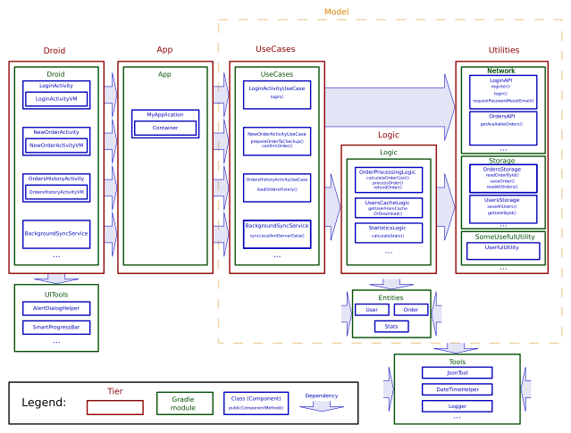

This file uses markdown formatting. Use a markdown reader (github/bitbucket/gitlab web interfaces can do it typically) to get nice formatted text.

# Introduction

This is an architecture description I use for an Android applications for the last years. This architecture showed itself in practice as an easy to understand, suitable and agile enough for most typical Android applications. It's core concepts can be used not only for Android applications, but theoretically for any platform (it was originally based on a server-side app I was participated in, then used in crossplatform Xamarin iOS-Android applications)

# Key concepts

## No circular dependencies

Circular dependencies is a pain. Beware of them at any price.

Let you have an object A. A calls an object B to do something. B calls an object C. C call an object D. This is ok.

Circular dependency happens when an object D calls an object A to do something. As a react, object A may ask B to do something more, than B calls C, than C calls D again, than D calls A, A calls B, B calls C, C calls A (unexpectedly?)... and so on. This behavior is very difficult to read, understand and debug.

The word "object" here typically refers to an object as it is meant by object-oriented programming, and may be interpreted as an Java-object, for example. So "A calls B" here means something like this

```java
import com.somepackage.B;

class A {

  B b;

  void doSomething(){
    b.doSomethingToo();
  }
}
```

We also can say that A depends on B in that case (do you see the import required to compile A.java?)

But this concept is not limited to OOP-object. If ```methodA()``` calls ```methodB()``` you may say that ```methodA()``` depends on ```methodB()```. Having a circular dependency for methods typically means a recursion. Recursion is a great thing sometimes, but if one recurrence consists of multiple method calls (especially if methods are placed in different block of code far from each other) it is very difficult to detect and debug.

If can also treat "object A" as any module of you application, such a gradle module, running instance, particular server, or something.


## Tiers

So, to beware from circular dependencies whole application is splitted into several tiers (some sources also call it "layers"). Concept is similar to multitier architecture, but particular tier roles are some different from [classic structure](https://en.wikipedia.org/wiki/Multitier_architecture).


Typical Android application has 4-5 tiers, but you may have more, if you need. Every tier contains one or more components. For Android application every component is represented with some Java object/class, typically, but not limited to. Typically every component is placed into separate Java-package. There is only one "main public" class in this package (see below).

Sometimes it is possible for a component to consist of two or more Java classes/objects. In this case make sure that only one "main" class/object has public visibility. Other classes in a components are threated as "helper" classes and should be package-private (or at least you should think about them as a package private). Helper entity classes/object are allowed to be public (see Entities section below). If you don't understand this paragraph, just ignore it for a while ans use a "one component = one class/object" as a rule

There are general rules about components:
- Different components inside of one tier are independent of each other. They don't even know about each other's existence. So, ```Component 1.1``` has no idea about ```Component 1.2```, and vice versa
- Any component of a tier may depend on any components of next tier. ```Component 1.X``` may depend on any ```Component 2.X```. Any ```Component 1.X``` may call any methods of ```Component 2.X```
- Any tier has no idea about previous tier. Tier 3 components doesn't depend on any of Tier 2 or Tier 1 components and have no idea about their existence.
- Typically, Tier 1 components should have no direct access to Tier 3 components. So, any tier should access only next tier, but not the next after next. There are some exceptions from this rule, see below.


## Captain and a deckhand
Although tiers below should not depend on tiers above, sometimes it is required for underlying tiers to communicate with tiers above. Here "Captain and a deckhand" concept comes to.

Have you ever been on a ship? On a small sailing yacht, hundred-meters long oil tanker or a warship with a thousands of soldiers? Any ship, either small or big one, has a captain and a deckhands.

There two general forms of communication between people on board: the _command_ and the _report_.

The _command_ is a set of words which require immediate and explicit action: "Steer 15 degrees to the left!", "Fore-sail up!", "Move anchor down for 7 meters!". The captain is the one who sends _commands_ to a deckhands.

The _report_ is a set of words which contain important information, but are not expected to be followed with an action: "Anchor is ready to go!", "Fuel is running low!", "Fore-sail is torn, need to repair". Deckhands are informing the captain with the _reports_. Report may be a result of previous command, or may be standalone, caused by some unexpected events.

The main difference between report and command is that report is not followed by any action, even if it is urgent and dangerous to life. "Captain, there are stones 100 meters ahead, we're going right to them!" - this is an important information, but nobody on the ship will do something with that until the captain's _command_.

It is very important to understand in any particular moment: is the word spoken a command or report? On a big commercial ships commands and reports are highly formalized to make communications clear. On a small sailing yacht, in a company of friends, especially if their sailing experience is quite equal, difference between captain and a deckhand may become not so clear, but it still persist. "Hey, John, do you see this stones ahead? Let's change our heading to the left a little" - this words will follow by a crew's action, or no, depending on who says it.

Sometimes it is possible also to have some officers between captain and a deckhand guys (multitier ship). In this case command may come not only from the captain, but from the officers. But the general command-report concept remains the same: captain sends command to an officer: "Prepare to departure!", than officer brings commands to a deckhands or to a lower-level officers: "Warm up the engines!", "Check up people on board", "Make anchor ready to raise". Reports may go back: from the deckhand to officer: "There is a problem in a reserve engine", and from the officer to a captain: "We are ready to departure in 10 minutes".

Typically it is not possible to move a ship (excepting very small boats) with only one man, you need a team usually. But any ship, including the smallest and biggest one, must have only one captain. It is impossible for a deckhand to send a _command_ to a captain - sailors beware of circular dependencies since the ancient times!

Same story with the components in your application. Typically an application consists of many components, it is impossible to build a complex application with one class only. Application components communicate to each other (typically with method calls). Every time one component communicates to another one you should understand, which component is a captain, and which one is a deckhand. Every time you see a method call, you should understand: is it a _command_ or _report_?

Typically, in this example

```java
import com.somepackage.B;

class A {

  B b;

  void doSomething(){
    b.doSomethingToo();
  }
}
```

A is the captain, and it sends _commands_ to B. B can use a Listener pattern (or Callback, or Observer, or something you prefer) to _report_ something useful to A


```java
//no import here required!

class B {

  private List<BListener> listeners = new ArrayList<>();

  public void addListener(BListener listener){
     listeners.add(listener);
  }

  public void removeListener(BListener listener){
    listeners.remove(listener);
  }

  private void fireSomethingHappened(){
    for(BListener listener : listeners){
      listener.onSomethingHappened();
    }
  }

  private void doingSomeRegularWork(){
    //....
    fireSomethingHappened();
    //....
  }


  public interface BListener{
    void onSomethingHappened()
  }
}
```

```java
import com.somepackage.B;

class A {

  B b;

  void subscribeBEvents(){
    b.addListener(new B.BListener(){
      public void onSomethingHappened(){
        onSomethingHappenedWithB();
      }
    });
    // Don't forget to unsubscribe when listening is no longer required
  }

  void onSomethingHappenedWithB(){
    //Analyze the situation here and provide new commands, if needed
  }
}
```

## Keep data separated from processing

The code below is a common pattern for various frameworks, especially ORMs.

`user.save()`  

First time I've seen this pattern in 2011 in Microsoft's Entity framework. Years ago I stll find this pattern ambigious and bad.

The user above is expected to be an Entity containing a data, like username, gender, date of birth, etc. This data is independent by it's nature - username is expected to stay the same disregarding of where this user is processed.

But, what code above does? It saves the user. But you can't just save the user by itself! (saving user's life or soul is not a something what can be done with code, so this is not the case). You save user to *somewhere*: to particular database, file, server storage, arraylist or whatever, but there is always a concrete place where you'll store the user.

What if we have multiple cases when this user should be saved to somewhere? The code above assumes that user entity knows something about where it shoud be stored. This can be ok in some particular cases, but in common this knowledge contradicts to the idea of independent entity.

To keep things clear I do not recomnend using this pattern. Instead, use separated   classes to represent the *data*

```java
class User{
    String username;
    Gender gender;
    Date dateOfBirth;
}
```

and use separated classes to *process* the data

`cacheFile.save(user)`  
`databaseStorage.store(user)`  
`serverApi.update(user)`  

See also Entities section about common entities restrictions.

## No static objects/references

Never use static references to keep any data/fields/objects. Also never use singleton pattern. If you have a single non-static object, it is always easy to make it visible in a static context, but vice versa is troublesome.

What's wrong with static objects? Their creation time is always undefined. When you use non-static objects, you'll always have a constructor call, which explicitly defines the time, place and order of objects creation. For static objects creation is usually implicit and may come in unexpected moment in time, what leads to hard-to-predict behavior and bugs. This is especially true when your objects keep references on each other.

On Android, Application object is a good place to keep any singleton object's - it is guaranteed by Android that you will always have one an only one instance of Application class. It is allowed to have a static reference to an Application object (this is the only one exception from the rule above) with some restrictions, see below. I think you can easily find an analog of this class in other platforms.

Static methods are allowed, although, \
a) if their execution and result depends only on it's parameters and nothing more. \
b) They do not change anything ouside exept it's parameters and return value
Various helpers are widely used to reduce boilerplate code

# General Architecture description



[Full size image](./arch.png)

Okay, now we'll start with application architecture itself.

## Gradle role

Pay some attention to gradle modules on the image above. Although you can put all the code into one module, and replace gradle modules with separate Java packages, I'd recommend you to use modules as specified (or, if you know better solution for the purpose described below, please send me a note). Gradle modules are used here as a tool to strictify dependencies.

- **Explicit add of new dependencies.** While using packages, it is very easy to add ```import``` to another package. In most cases IDE like Android Studio will add ```import```'s almost automatically, sometimes even without notifying the developer. In contrast, Gradle dependencies are very explicit, they are almost never added automatically. Even when dependency is suggested by IDE, you'll have an explicit dialog and long-running gradle sync process after, so you'll less likely miss it.
- **Less dependencies, more control.** Every particular Java class file usually has dozens of imports, they are changing often, and it is not easy to control their consistence. In contrast, there are only few gradle dependencies in the project, and they are rarely changed. You (or your team lead) can easily control that no gradle dependencies has been changed improperly
- **Gradle forbids circular dependencies.**. If you'll have a module A referencing module B, is is impossible to create opposite direction reference, you'll get an exception during build. At the same time, Java has no any restrictions about circular ```import```'s

## Arcitecture bricks

Let's go through the architecture and define, what components it contains

### Utilities

<h4>Network</h4>

This module is responsible for sending network requests, receiving data from server, managing connections (if required) etc.

Main public class of the components of this module will typically contain a set of methods like

`ResponseData SendRequest(RequestParams params)`  

Every such a method maps exacltly one request of the API you use. If you use an HTTP API, these methods are the only you need. If you use an API with permanent connection, like direct sockets, WebSockets or similar, you'll also probably need a methods like `connect()` and `disconnect()`, plus an event generator for incoming requests.

I do not recommend put all of the APIs you use into one component. You may have as many network components as you need. Typically, I group public methods into component based on their applicability, maximum 3-5 methods per component: one component will contain all the methods working with user login, another - all the methods processing shop catalog, third - everything about the order processing. But this is not a strict rule, so you may group methods in your component at you choice: as far as most of the API calls are independent from each other, grouping doesn't matter a lot. If you use multiple backends for your needs (for example, your own backend + Facebook API), you may also consider that for grouping.

Public component methods should accept/return global or local Entities as an input/output. Network classes are fully responsible for request formatting and response parsing.

If using global-scope Entities as input/output, network classes should not rely on Entities' structure, field names, etc for parsing and formatting. This case, if an API developer would perform some simple refactoring, which does not change overall application logic (for example, request parameter name would be changed, or JSON response fields would be rearranged), such a refactoring should affect only Network module, without changing public method signatures, Entities and outer code. See also Entities section.

Very important: do not store any data inside the Network module. Public methods behavior should depend only on server state and method parameters passed. Do not store authorization tokens, cookies, other similar data in Network classes fields - use Storage module for that purpose. Network modules are designed for network processing, not for data storage.

Network modukes are also responsible for error handling. This includes connection errors, response formatting errors, server errors - any of them should be handled accurately and translated into independent form. I personally prefer to throw Exceptions, but this is optional, you may provide specific Entity instead.

Retrofit note. (Retrofit is a commonly used network library). You can use Retrofit for request/response formatting, but consider the requirements above. Basic Retrofit features include: relying on Entity field names for formatting, storing a data (like auth tokens) inside the network module - be aware of using this features. Also, note that default Retrofit configuration does not raise any errors, if some required response fields are missing - it just silently puts null into your Entity. Considering that, I find Retrofit quite useless for Wooden architecture, and recommend using OkHttp and manual Json parsing instead.

<h4>Storage</h4>

Storage module represents disk storage. It is responsible for everything needed to store data on internal disk storage: SharedPreferences and SQLite databases is a common example.

Public component methods for this module typically look like:  
`void saveSomething(SomeEntity something)`  
`SomeEntity readSomething()`  

It is a common mistake to put some business logic into Storage to "optimize application performance". Although there is nothing wrong with some particular optimizations (for example, there is no need to fetch full table if you need only few records, so WHERE filters are surely appropriate), remember that main storage purpose is to provide save and read functions, but not business logic and data transformation.

Similar to Network module, you may have multiple Storage components, grouped based on their business purpose. But keep various storages independent from each other. When using SharedPreferences, it makes sense to use separate preferences file for every storage (see first parameter [here](https://developer.android.com/reference/android/content/Context?hl=en#getSharedPreferences(java.lang.String,%20int))). When using Room storage, the task is more complicated.

Sometimes you may want to put all the SQL tables into one Storage, but this may cause your Storage grow too large and complicated. Sometimes you may want to create separate SQL database for every table, to keep the tables independent. This sounds like a nice idea, but it will cause a) too many boilerplate code ti initialize every DB instance b) more complicated migration management, as far as every database will migrate independently.

Compromise solution is to use single database instance as a "backend" for multiple storages. In this case you need to make sure you Storages are independent. No cross-Storage foreign key constraints are allowed, and no cross-Storage JOINs are allowed.

By the way, I do not recommend using JOINs and foreign keys at all, at least as far as you have no performance issues. Remember that main Storage purpose is to read and write data. JOINs and foreign keys typically represent a business logic relations between data items, and this logic is not welcome on Storage tier. As far as your performance is fine, do as many logic as possible on Logic or UseCase tier. Yes, I would prefer a `for` loop to JOIN - most of Android developers are good Java developers, but not so good in SQL dialects, so `for` loop is more readable in general. :) Android application rarely has really large database, iterating up to 10000 objects in a `for` loop is not a problem (of course, if you would not make a database request at every iteration). So, again, prefer Logic tier for joining operations and use SQL joins only if have no other option.

The Storage tier is the only place where you should store your data on disk. Do not use SharedPreferences outside on Storage tier, do never store sensitive data in Activity's `savedInstanceState`, and so on. Keeping all the disk-stored data in one module gives you the following benefits
- Every time when you launch your application, it's behavior, in fact, depends only on what is stored on disk. Stored data is what defines application _state_ in every particular moment between launches. Keeping storages together, you keep all the state in one place.
- When a new developer comes to a project, let him know what the application state contains of. This will simplify his/her onboarding.
- Sometimes it happen so that application _state_ remains the same, but the application _code_ changes. Users call it "update the application of a new version", developers know that update often causes a Storage migration. If you keep all the data in one place, your migration will stay limited to Storage tier only.

By the way, about migration. If not the all user's data is stored on server, and you can't just logout user after every version update, once upon a time you will meet a migration, sooner or later. It will happen unexpectedly, so think about it in advance. As a minimum, put a `version=1` key-value to your storage.

### Entites

Entities are data objects. They represent a pieces of data which components transfer to each other as method parameters and return values. All the public component methods should have only entities and collections of entities as a parameters and return values.

Entites are POJO's (Plain Old Java Objects). They do only contain data. They do not contain any logic, they only store, but do not _process_ any data. They have fields, and have no methods, excepting getters, constructors, and (see below) setters.

As a rare exemption, short pure methods are allowed, if they do not change entity fields and their behavior is affected only by entity fields. For example, if you have `Order` entity, which contains a list of `OrderItem` entites, you may find quite handy to add `getItemCount()` method to `Order` class. But in case of any doubts prefer to put data processing methods to Logic classes.

Although is is not 100% strict, I highly recommend you to use only _immutable_, read-only entities. In this case, no setters are allowed in Entity classes. Also, although Java does not have a good support for that ([here is an option](https://docs.oracle.com/javase/1.5.0/docs/api/java/util/Collections.html#unmodifiableList(java.util.List))), I recommend you to treat any Entity collections as read-only. Using immutable entities and lists makes you sure, that after you receive the Entity as a return value from some method, no one will unexpectedly change it. If you need to modify entity - just create a new one!

There are two types of entities in the architecture: global and local ones.

<h4>Global entities</h4>

Global entities are stored in Entities module and are used over all application. Even UI tier can use them. It is reasonable for simple applications: if you have to download `Order` from your server and show it "as is" in your UI, there is no reason to make things too complicated. Just create an `Order` entity and pass it through all the tiers from network to UI.

There is a constraint here, although. Global Entities should depend on **nothing**. Entities gradle module does not have any dependencies, excepting `Tools` module. They should not rely on network and storage.

There is a common pattern to use some third-party tools, like Retrofit (commonly used network library), Room (commonly used SQL databases library), or similar, to automatically convert POJO so JSON API request or SQLite tables, based on entity field names. This is **strictly forbidden** for global Entites. Even when such a conversion does not cause a gradle dependency, this causes an implicit binding between entity and network request/database format. As far as global entities are used globally, this  binding can have critical consequences.

Let me repeat again. `@SerializedName` (a common Retrofit pattern) is forbidden when using Global entities. But even if by occasion you Entity field names match API JSON keys, you must provide manual parsing from JSON to Entity and back. Same story for Room - your entity is not a room `@Entity`, and you should never expect them to be same.

The key idea is that if backend developer would like to rename some API field, this rename should not affect (i.e. should cause NO code changes to) your Entity and should not affect (i.e. should cause NO code changes to) your UI classes. Similar to, if one day you would like to slightly refactor your Room database, this refactoring should be limited to Storage module as long as possible.

<h4>Local entities</h4>

Once your application grows, you will find that what you store in your database does not perfectly match to what send/receive via network and to what you show on UI. Look at the Sample app. You may find that although it is a quite simple app, `CityForecast` formats in storage, network and UI have differences which are not only about field names or field formats, they have differences in it's sense.

For example, `CityForecast` in storage uses a `lastUpdatedAt` field. This fields shows when the particular `CityForecast` was updated from the server, and used as a marker to renew a cached value. Obviously, you do not receive `lastUpdatedAt` from your server, so Network module should not care about it. Also, as far as it is used for caching, i.e. for developer's need, we do not show it to user, so UI level also has nothing to do with `lastUpdatedAt`.

On the other hand, "UI-level-forecast" has to deal with `isWeatherGoodForRunning()` option. This is a just a UI-level marker, we don't want to burden `ForecastStorage` or `ForecastAPI` with this information.

This is where local entities come to play. They are also POJOs, read-only and used as a public component method parameters/return values. But they are related to particular component. Local entities are declared at the same place where corresponding component is declared (as component inner class or as a separate class, but in the same package with component). That means they have same visibility scope as the component.

For example, `CityForecastCache` class relates to `ForecastStorage` and has same visibility as `ForecastStorage`. That means UseCase and Logic classes can access `CityForecastCache`, but Network and UI classes can not.

Because of the reduced visibility, independence constraint for Local entities is relaxed. They may depend on same tools and libraries their component depends on. That means they, if needed, can be used with Retrofit/Room for automatic parsing. It is still recommended to keep Local entity public interface independent, but this is not 100% mandatory. In best case, if backend developer API will change some JSON fields, local entity public interface should not change. In worst case, it will change, and Logic and UseCase classes using this object will also change, but rest of the application will stay untouched.

When creating Local entites, you may create the as a completely new entity (with newly created fields. for ex. `MainScreenUseCase.ForecastItem`), or create is as a wrapper over another Entity (global or local - example is `ForecastStorage.CityForecastCache`, which is a wrapper over `CityForecast`). As far as all Entities are immutable, both approaches are fine, but when using last one, make sure your wrapper does not disclose unnecessary information of inner object - inner object may relate to another tier.


### Use Cases

**TODO**

-------------------------------------------------------

application - fix cache
application - add good weather settings


memstorage

other utils - bluetooth, outer devices, external file access, etc

entities

usecases


main public class define

Public component methods define

android - activity is a captain

multiple captains in a software

disclaimer - architecture is a journey

# Data separately, algorithms separately

synchornous model

# Android details

Unit

# Interfaces, DI

# Threading

# Enhancements - events

# Enhancements - multiple logic tiers


//TODO - Billfold refinings
//
